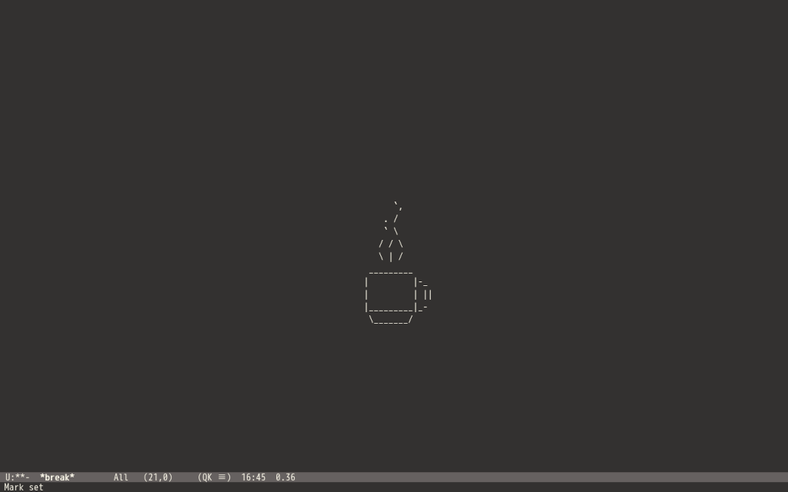

# QK Mode

As we all know, taking breaks is essential for maintaining productivity and overall wellness during long workdays. QK mode is a major mode for GNU Emacs that helps remind you to take a break during your workday.



## Installation

To install QK mode, simply download the `qk-mode.el` file from GitHub and save it to your Emacs Lisp directory, which is usually `~/.emacs.d/elisp/`. Then, add the following line to your Emacs configuration file:

```
(add-to-list 'load-path "~/.emacs.d/elisp")
(require 'qk-mode)
```

## How to use

To activate QK mode, simply run the command `M-x qk`. This will switch the buffer and display a coffee cup in the center of the frame, with steam rising from the cup. The steam will continue to rise every second until you stop it. After the break, disable QK mode by executing the `C-g` command twice.

Taking breaks at regular intervals is important for mental and physical health. Research has shown that taking breaks can improve focus, creativity, and cognitive function. In addition, taking breaks can prevent burnout and reduce stress levels.

QK mode is a helpful tool for those who may forget to take breaks. We hope that QK mode will help you take the breaks you need to stay focused and productive!
